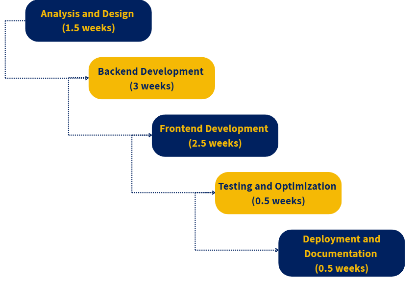
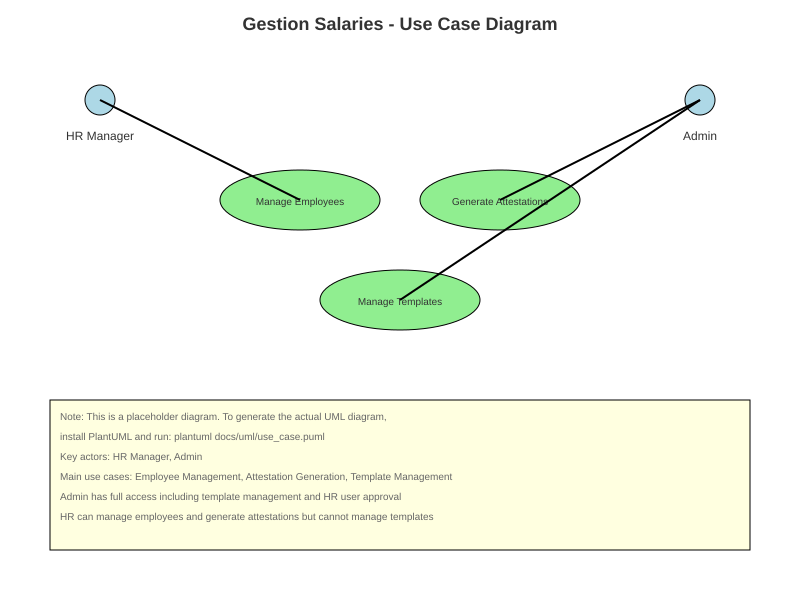
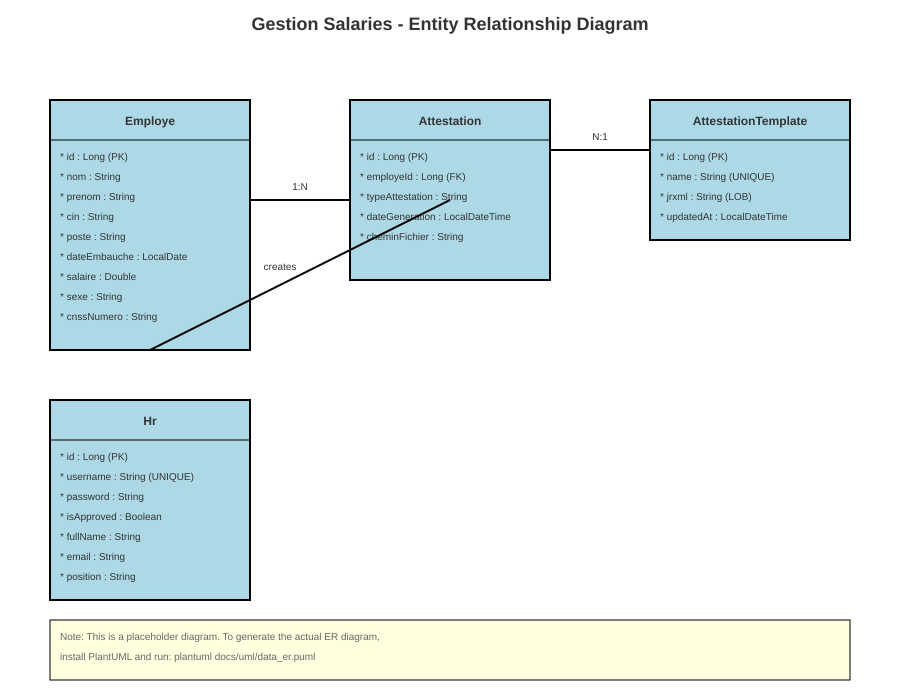

# System Diagrams

This document contains all visual representations of the Gestion Salaries system architecture, processes, and data flow.

## Project Timeline

### Gantt Chart
The project timeline is visualized through a comprehensive Gantt chart showing the 2-month development process using the Waterfall methodology.


**Interactive Preview**: [View Gantt Chart](../../docs/gantt/index.html)

**Key Phases**:
- Analysis & Design: 1.5 weeks
- Backend Development: 3 weeks  
- Frontend Development: 2.5 weeks
- Testing & Integration: 0.5 weeks
- Deployment & Documentation: 0.5 weeks

## Development Methodology

### Waterfall Process Diagram
The waterfall methodology visualization shows the sequential development approach used for this project.



**Description**: This diagram illustrates the structured waterfall approach with clear phase boundaries and sequential progression. Each phase must be completed before moving to the next, ensuring thorough validation and quality control.

## System Architecture

### Use Case Diagram
Shows the interaction between different user roles and system functionalities.



**Key Actors**:
- **HR Manager**: Can manage employees and generate attestations
- **Admin**: Has full system access including template management and HR user approval

**Main Use Cases**:
- Employee Management (CRUD operations)
- Attestation Generation (5 certificate types)
- Template Management (Admin only)
- User Authentication and Profile Management

### Entity Relationship Diagram
Illustrates the database schema and relationships between entities.



**Core Entities**:
- **Employe**: Stores employee information including personal details, salary, and employment data
- **Attestation**: Links employees to generated certificates with metadata
- **AttestationTemplate**: Stores JRXML templates for different certificate types
- **Hr**: Manages HR user accounts and permissions
- **Parametre**: System configuration parameters

**Key Relationships**:
- Employee 1:N Attestation (one employee can have multiple attestations)
- Template 1:N Attestation (one template can be used for multiple attestations)
- HR 1:N Attestation (HR users create attestations)

### Sequence Diagram
Shows the detailed flow of attestation generation process.


**Process Flow**:
1. HR user selects employee and attestation type
2. System validates employee existence
3. Template lookup and validation
4. PDF generation with JasperReports
5. File storage and database recording
6. Download link provision to user

## Technical Architecture

### System Components
```
┌─────────────────┐    ┌─────────────────┐    ┌─────────────────┐
│   React Frontend│    │  Spring Boot    │    │   MySQL         │
│   (Material-UI) │◄──►│  REST API       │◄──►│   Database      │
│   Port: 3000    │    │  Port: 8080     │    │   Port: 3306    │
└─────────────────┘    └─────────────────┘    └─────────────────┘
                              │
                              ▼
                       ┌─────────────────┐
                       │ JasperReports   │
                       │ PDF Generator   │
                       └─────────────────┘
```

### Technology Stack Visualization
- **Frontend Layer**: React 19.x, Material-UI, Axios
- **Backend Layer**: Spring Boot 3.5.3, Spring Data JPA, Spring Security
- **Database Layer**: MySQL 8.0+, JPA/Hibernate
- **PDF Generation**: JasperReports 7.0.3
- **Development Tools**: Maven, IntelliJ IDEA, VS Code

## Data Flow Diagrams

### Employee Management Flow
```
User Input → Validation → Service Layer → Repository → Database
     ↓
Response ← DTO Mapping ← Business Logic ← Data Access ← Query Result
```

### Attestation Generation Flow
```
Employee Selection → Template Validation → PDF Generation → File Storage
     ↓
Database Record ← File Path ← JasperReports ← Employee Data
```

## Security Architecture

### Authentication Flow
```
Login Request → Password Validation → JWT Token Generation → Role Assignment
     ↓
Protected Resource Access ← Token Validation ← Authorization Check
```

### Role-Based Access Control
- **Admin**: Full system access, template management, HR approval
- **HR**: Employee management, attestation generation, limited system access

## Performance Considerations

### Database Optimization
- Indexed primary keys and foreign keys
- Optimized queries for employee search
- Connection pooling configuration

### Frontend Optimization
- Component lazy loading
- Material-UI theme optimization
- Axios request caching

### PDF Generation Optimization
- Template compilation caching
- Async PDF generation
- File system optimization

## Deployment Architecture

### Production Environment
```
Load Balancer → Web Server → Application Server → Database Server
     ↓
Static Files (React Build) ← Spring Boot JAR ← MySQL Database
```

### Development Environment
```
Developer Machine → Local MySQL → Spring Boot Dev Server → React Dev Server
```

## Monitoring and Maintenance

### Application Monitoring
- Spring Boot Actuator endpoints
- Database connection monitoring
- PDF generation performance tracking

### Logging Strategy
- Application logs (Spring Boot)
- Database query logs
- PDF generation logs
- Security audit logs

---

*All diagrams are generated from machine-readable sources and can be regenerated using the provided scripts and tools.*
